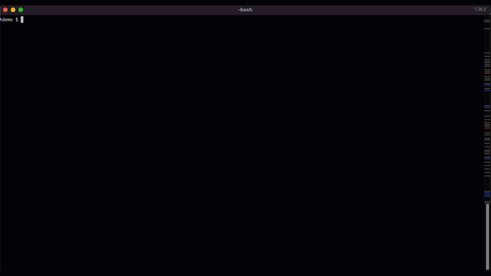
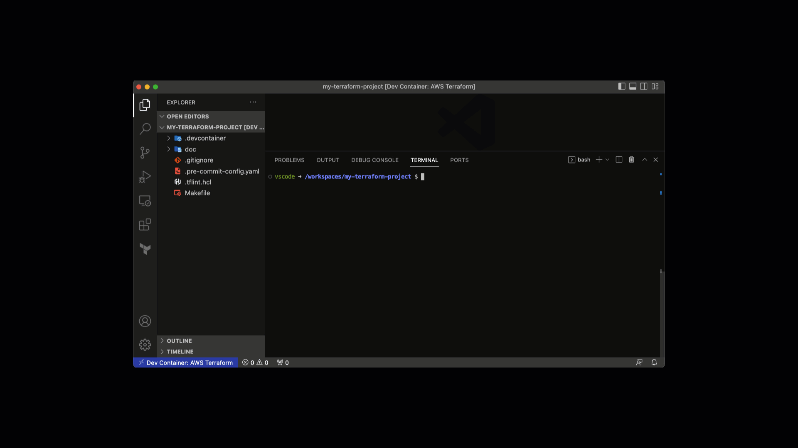
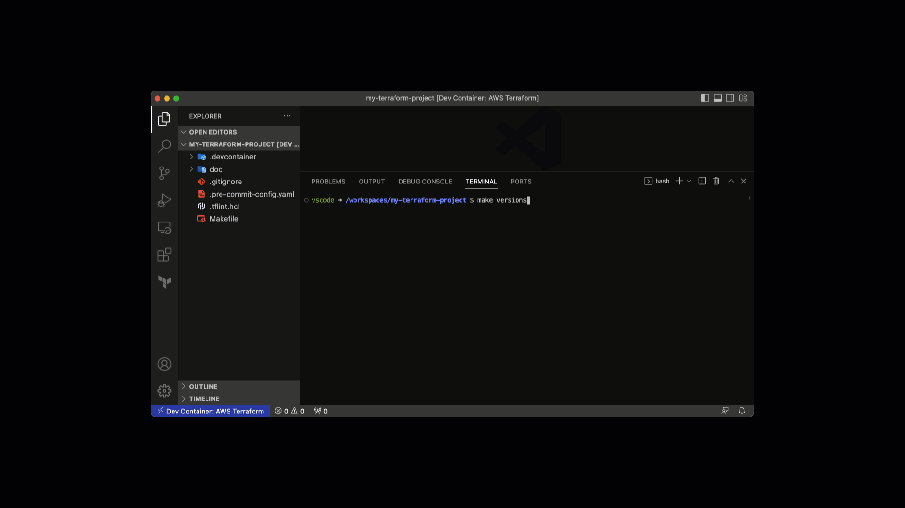
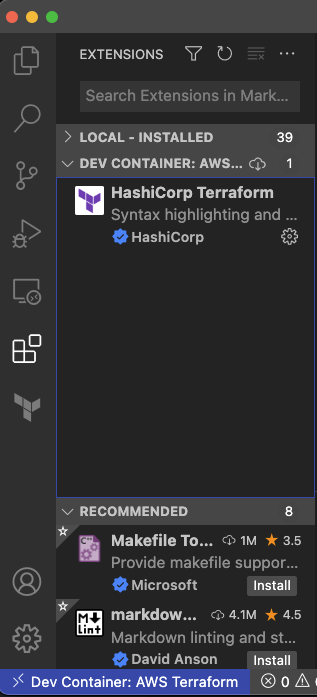

<!--
  ** MANAGED BY AWS CODE HABITS
  ** DO NOT EDIT THIS FILE
  **
  ** 1) Make all changes to `doc/habits.yaml`
  ** 2) Run `make doc/build` to rebuild this file
  **
-->

![logo][logo]


# AWS Terraform Dev Container

A VSCode Dev Container with [tools][tools] to help you build and manage AWS infrastructure with Terraform

|  |
|:--:|
| *Develop your project in a Docker container* |

|  |
|:--:|
| *Increase productivity with well-defined `Make` commands* |

|  |
|:--:|
| *Ensure every team member has all the tools on their correct versions* |

|  |
|:--:|
| *Extensions already installed for you* |


## Table of Contents

- [Getting Started](#getting-started)

- [Prerequisites](#prerequisites)


- [Usage](#usage)


## Getting Started

1. On a terminal, inside your Terraform project, execute the following on Mac, Linux or [WSL][wsl]:
```bash
curl -sL https://raw.githubusercontent.com/awslabs/aws-terraform-dev-container/main/scripts/init.sh | bash
````
2. Open the folder with VSCode
3. Reopen in Container

To reopen in container manually, open the [command pallete](https://code.visualstudio.com/docs/getstarted/userinterface#_command-palette) on VS Code and select `Rebuild and Reopen in Container`


## Prerequisites
  A list of things you need, or how to install them.

- [Docker](https://www.docker.com/products/docker-desktop/) - The fastest way to containerize applications
- [Visual Studio Code](https://code.visualstudio.com/) - Visual Studio Code is a code editor redefined and optimized for building and debugging modern web and cloud applications.
- [VSCode Remote Development Extension Pack](https://marketplace.visualstudio.com/items?itemName=ms-vscode-remote.vscode-remote-extensionpack) - An extension pack that lets you open any folder in a container, on a remote machine, or in WSL and take advantage of VS Code's full feature set.


## Usage
```bash
make [tab][tab]
```
For example, if you want to explore the most common [terraform][terraform] commands:
```bash
make terraform/[tab]
apply     clean     destroy   fmt       init      init/     plan      validate  version
```

To display all available commands:
```bash
make help
```
For more information about each [Make targets available](Makefile.md).


## References
- [Terraform by HashiCorp](https://www.terraform.io) - Terraform is an open-source infrastructure as code software tool that enables you to safely and predictably create, change, and improve infrastructure.
- [Changelog](CHANGELOG.md) - All notable changes.
- [Code Of Conduct](CODE_OF_CONDUCT.md) - Amazon Open Source Code of Conduct
- [Contributing](CONTRIBUTING.md) - Learn how to contribute
- [License](LICENSE) - MIT No Attribution
- [GNU Make](https://www.gnu.org/software/make/manual/make.html) - If you are new to make, or are looking for a general introduction.

- [AWS Code Habits][aws-code-habits] - A library with Make targets, Ansible playbooks, Jinja templates (and more) designed to boost common software development tasks and enhance governance.

## License
This project is licensed under the MIT-0 License. See the [LICENSE](LICENSE) file.

## Copyright
Copyright Amazon.com, Inc. or its affiliates. All Rights Reserved.


[repo]: https://gitlab.aws.dev/proserve-labs/aws-terraform-dev-container
[logo]: doc/logo.png

[aws-code-habits]: https://github.com/awslabs/aws-code-habits

[docker]: https://www.docker.com/products/docker-desktop/
[vscode-dev-container]: https://code.visualstudio.com/docs/remote/containers
[terraform]: https://www.terraform.io
[license]: LICENSE
[tools]: TOOLS
[wsl]: https://learn.microsoft.com/en-us/windows/wsl/install
