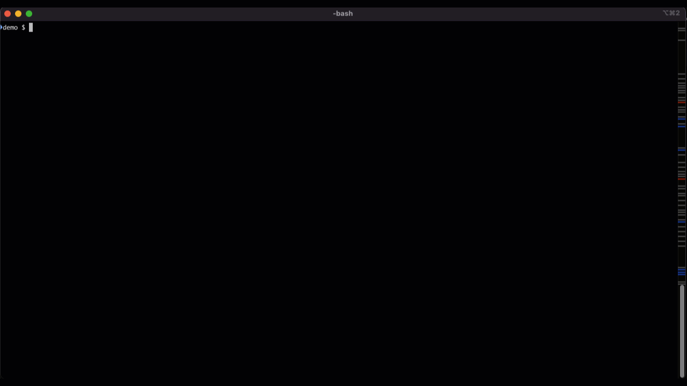

# Terraform Development Environment

A Visual Studio Code dev container that gives you a pre-configured environment for developing, testing, and deploying Terraform infrastructure as code across AWS, Microsoft Azure, and Google Cloud Platform (GCP).

[](LICENSE)
[](https://github.com/awslabs/aws-terraform-dev-container/releases)

## Overview

This repository packages a [Visual Studio Code dev container](https://code.visualstudio.com/docs/devcontainers/containers) for Terraform development. When you open the repository in VS Code and reopen it in the container, you get a Docker image with Terraform, the AWS, Azure, and GCP command line interfaces, and a suite of Terraform linting, security, testing, and cost-estimation tools already installed and pinned to known versions.

The container addresses the setup and consistency problems that come with infrastructure as code work: every contributor runs the same tool versions, credential directories are mounted from the host instead of stored in the image, and pre-commit hooks enforce formatting and security scanning before code is committed. It is intended for infrastructure engineers, platform teams, and anyone learning Terraform who wants a reproducible environment without installing tools on the host.

The image targets Linux containers on the `linux/amd64` and `linux/arm64` architectures.

## Features

- Multi-cloud command line tooling: AWS CLI v2, Azure CLI, and Google Cloud SDK.
- Terraform and supporting tools: `terraform`, `terraform-docs`, `tflint` (with AWS, Azure, and GCP rulesets), `tfsec`, `terrascan`, `terragrunt`, Terratest, `infracost`, `checkov`, and `pre-commit`.
- VS Code integration: pre-installed extensions, editor settings, and tasks for common Terraform and authentication workflows.
- Pre-commit hooks for Terraform formatting, validation, documentation, security scanning, and secret detection.
- Host credential mounts for AWS, Azure, GCP, and SSH, so credentials stay on the host.
- A persistent Terraform plugin cache to speed up repeated `terraform init` runs.

## Prerequisites

- [Docker](https://www.docker.com/products/docker-desktop/) — runs the container.
- [Visual Studio Code](https://code.visualstudio.com/) — the supported editor.
- The [Dev Containers extension](https://marketplace.visualstudio.com/items?itemName=ms-vscode-remote.remote-containers) (included in the [Remote Development extension pack](https://marketplace.visualstudio.com/items?itemName=ms-vscode-remote.vscode-remote-extensionpack)).
- [Git](https://git-scm.com/) — clones the repository and its submodule.

## Installation

You can use the dev container in two ways: open this repository directly, or add the container to an existing Terraform project.

### Open this repository

Clone the repository with submodules. The `Makefile` depends on the bundled [aws-code-habits](https://github.com/awslabs/aws-code-habits) submodule under `habits/`:

```bash
git clone --recurse-submodules https://github.com/awslabs/aws-terraform-dev-container.git
```

To clone over SSH:

```bash
git clone --recurse-submodules git@github.com:awslabs/aws-terraform-dev-container.git
```

If you already cloned the repository without `--recurse-submodules`, initialize the submodule:

```bash
git submodule update --init --recursive
```

### Add the container to an existing project

From the root of an existing Terraform project, run the bootstrap script. It copies the `.devcontainer/` directory into your project and adds `aws-code-habits` as a submodule (or a plain clone if the directory is not a Git repository):

```bash
curl -fsSL https://raw.githubusercontent.com/awslabs/aws-terraform-dev-container/main/scripts/init.sh | bash
```

Review [`scripts/init.sh`](scripts/init.sh) before you run it.

## Getting started

1. Open the project folder in VS Code:

   ```bash
   code aws-terraform-dev-container
   ```

2. When VS Code prompts you, select **Reopen in Container**. You can also open the command palette (`F1`) and run **Dev Containers: Reopen in Container**.

3. Wait for the container to build. The first build downloads the base image and installs the tools, which can take several minutes.

4. When the container starts, the post-start command clears the terminal and prints the installed tool versions, the working directory, and authentication hints.



Once the container is running, authenticate to a cloud provider and initialize Terraform:

```bash
.devcontainer/scripts/aws-auth.sh
terraform init
```

For a full walkthrough, see [USAGE.md](USAGE.md).

## Usage

You run Terraform and its supporting tools from the integrated terminal, or through VS Code tasks. To run a task, open the command palette (`Ctrl+Shift+P`, or `Cmd+Shift+P` on macOS), select **Tasks: Run Task**, then choose a task.

The container defines these tasks in [`.vscode/tasks.json`](.vscode/tasks.json):

| Task | Command |
| --- | --- |
| Terraform: Init | `terraform init` |
| Terraform: Plan | `terraform plan -out=tfplan` |
| Terraform: Apply | `terraform apply tfplan` |
| Terraform: Apply (Auto-approve) | `terraform apply -auto-approve` |
| Terraform: Destroy | `terraform destroy` |
| Terraform: Validate | `terraform validate` |
| Terraform: Format | `terraform fmt -recursive` |
| Terraform: Clean | Remove `.terraform/`, the lock file, state files, and `tfplan` |
| TFLint: Run | `tflint` |
| TFSec: Run | `tfsec .` |
| Checkov: Run | `checkov -d .` |
| Pre-commit: Run All Hooks | `pre-commit run --all-files` |
| AWS: Login | `.devcontainer/scripts/aws-auth.sh` |
| AWS: Login with SSO | `.devcontainer/scripts/aws-auth.sh --sso` |
| Azure: Login | `.devcontainer/scripts/azure-auth.sh` |
| GCP: Login | `.devcontainer/scripts/gcp-auth.sh` |

To authenticate to a cloud provider from the terminal, run the matching helper script:

```bash
.devcontainer/scripts/aws-auth.sh [--profile PROFILE] [--region REGION] [--sso]
.devcontainer/scripts/azure-auth.sh [--subscription SUBSCRIPTION_ID] [--tenant TENANT_ID] [--service-principal --client-id CLIENT_ID --client-secret CLIENT_SECRET]
.devcontainer/scripts/gcp-auth.sh [--project PROJECT_ID] [--credentials FILE_PATH]
```

To install the pre-commit hooks in your repository:

```bash
pre-commit install
```

For the complete usage reference — the Terraform workflow, multi-environment patterns, and pre-commit hooks — see [USAGE.md](USAGE.md). For the `make` targets inherited from `aws-code-habits`, see [Makefile.md](Makefile.md).

## Configuration

### Tool versions

Tool versions are pinned as build arguments in [`.devcontainer/devcontainer.json`](.devcontainer/devcontainer.json) and the [`.devcontainer/Dockerfile`](.devcontainer/Dockerfile). To change a version, edit the corresponding build argument and rebuild the container (**Dev Containers: Rebuild Container**). The repository ships these versions:

| Tool | Version | Description |
| --- | --- | --- |
| Terraform | 1.12.1 | Infrastructure as code tool. |
| AWS CLI | v2 | Command line interface for AWS. |
| Azure CLI | OS-provided (apt) [^1] | Command line interface for Azure. |
| Google Cloud SDK | OS-provided (apt) [^2] | Command line interface for GCP. |
| terraform-docs | 0.20.0 | Documentation generator for Terraform modules. |
| tflint | 0.48.0 | Terraform linter. |
| tfsec | 1.28.13 | Security scanner for Terraform code. |
| terrascan | 1.19.9 | Compliance and security violation detector. |
| terragrunt | 0.50.1 | Wrapper that adds tooling around Terraform. |
| Terratest | 0.49.0 | Go testing library for infrastructure code. |
| infracost | 0.10.41 | Cost estimates for Terraform. |
| checkov | 3.2.439 | Static analysis for infrastructure as code. |
| pre-commit | Latest (pip) [^3] | Framework for managing Git pre-commit hooks. |

[^1]: Installed from Microsoft's official apt repository. See [Install the Azure CLI on Linux](https://learn.microsoft.com/en-us/cli/azure/install-azure-cli-linux).
[^2]: Installed from Google Cloud's official apt repository. See [Install the gcloud CLI](https://cloud.google.com/sdk/docs/install#deb).
[^3]: Installed with `pip install pre-commit` during the container build. To pin a version, edit `.devcontainer/library-scripts/common-utils.sh`.

### Environment variables

You configure Terraform and cloud-provider environment variables in [`.devcontainer/config/terraform.env`](.devcontainer/config/terraform.env). The post-start command sources this file when the container starts. The file ships with the Terraform variables set and the cloud-provider variables commented out:

- Terraform: `TF_PLUGIN_CACHE_DIR`, `TF_CLI_ARGS_init`, `TF_CLI_ARGS_plan`, `TF_CLI_ARGS_apply`, `TF_LOG`.
- AWS: `AWS_PROFILE`, `AWS_REGION`, `AWS_SDK_LOAD_CONFIG`.
- Azure: `ARM_SUBSCRIPTION_ID`, `ARM_TENANT_ID`, `ARM_CLIENT_ID`, `ARM_CLIENT_SECRET`.
- GCP: `GOOGLE_APPLICATION_CREDENTIALS`, `CLOUDSDK_CORE_PROJECT`.

The container also sets `TF_PLUGIN_CACHE_DIR` through the `containerEnv` block in `devcontainer.json`.

### VS Code settings, extensions, and hooks

- Edit `.vscode/settings.json` to change editor settings.
- Edit the `customizations.vscode.extensions` list in `devcontainer.json` to change installed extensions.
- Edit `.pre-commit-config.yaml` to change the pre-commit hooks.
- Edit the `.devcontainer/Dockerfile` and add a script under `.devcontainer/library-scripts/` to install additional tools.

## How it works

The container is built from `.devcontainer/Dockerfile`, which starts from a pinned Microsoft VS Code dev container base image (Ubuntu 22.04) and runs three library scripts:

- `common-utils.sh` installs common packages and `pre-commit`.
- `cloud-cli-tools.sh` installs the AWS, Azure, and GCP command line interfaces.
- `terraform-tools.sh` installs Terraform and its ecosystem, verifying each binary download against a published SHA256 checksum.

The container mounts the host credential directories (`~/.aws`, `~/.azure`, `~/.config/gcloud`, `~/.ssh`) and a named Docker volume for the Terraform plugin cache. The `postStartCommand` runs `post-start`, which loads the environment variables and prints the welcome banner. The GitHub CLI and Git are added through dev container features.

For the original design plan, see [terraform-devcontainer-plan.md](terraform-devcontainer-plan.md).

### Security considerations

- Credentials are mounted from the host rather than stored in the image.
- Binary downloads in the build are verified against published SHA256 checksums (see `.devcontainer/library-scripts/terraform-tools.sh`).
- The base image is pinned to a specific minor version rather than a floating tag, and third-party GitHub Actions used in continuous integration (CI) are pinned to commit SHAs.
- Cloud-provider CLIs (Azure CLI, Google Cloud SDK) are installed from their vendors' official apt repositories with `signed-by=` keyrings.
- Pre-commit hooks run security scanning and secret detection before code is committed.

## Troubleshooting

| Issue | Resolution |
| --- | --- |
| Docker is not running. | Start Docker on your host before you reopen the folder in the container. |
| The container fails to build. | Increase the memory Docker is allowed to use, then rebuild. |
| Authentication fails. | Confirm your credentials with `aws sts get-caller-identity`, `az account show`, or `gcloud auth list`. |
| Volume mounts are empty. | Confirm the source directories (`~/.aws`, `~/.azure`, `~/.config/gcloud`, `~/.ssh`) exist on the host. |
| `make` targets do not run. | Initialize the submodule with `git submodule update --init --recursive`. |

To view the container build log, select the **Remote** indicator in the bottom-left corner of VS Code and choose **Show Container Log**. For more guidance, see the Troubleshooting section of [USAGE.md](USAGE.md).

## Contributing

See [Contributing](CONTRIBUTING.md) for how to propose changes.

## Security

See [Security](SECURITY.md) for how to report a vulnerability.

## License

This project is licensed under the MIT-0 License. See [LICENSE](LICENSE) for details.
