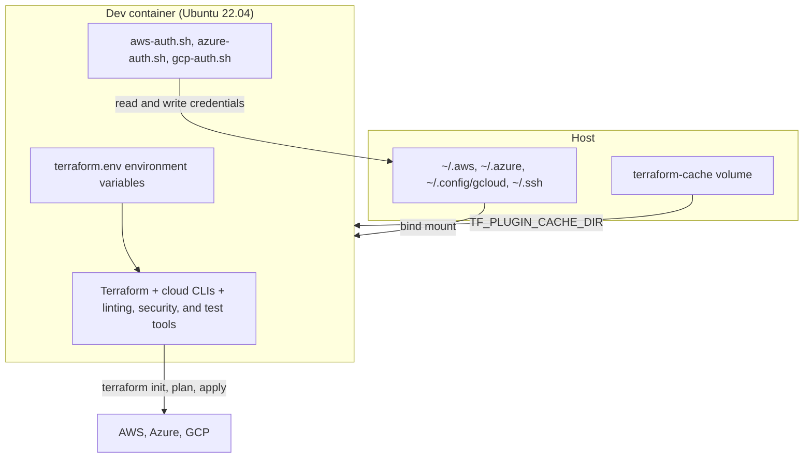

# Usage

This guide describes how to work in the Terraform Development Environment dev container: opening it, running Terraform, authenticating to cloud providers, using pre-commit hooks and VS Code tasks, and resolving common problems. For an overview of the container and its tools, see [README.md](README.md).

## Open the dev container

1. Open the project folder in Visual Studio Code.
2. When VS Code prompts you, select **Reopen in Container**. You can also open the command palette (`F1`) and run **Dev Containers: Reopen in Container**.
3. Wait for the container to build and start.

When the container starts, the post-start command clears the terminal and prints the installed tool versions, the working directory, and hints for authenticating to each cloud provider.

The following diagram shows how the running container is wired to the host. Credential directories are bind-mounted from the host, and the Terraform plugin cache is a named Docker volume:



After the container is running, complete the initial setup:

1. Authenticate to a cloud provider (see [Authenticate to a cloud provider](#authenticate-to-a-cloud-provider)).
2. Install the pre-commit hooks:

   ```bash
   pre-commit install
   ```

3. Initialize Terraform:

   ```bash
   terraform init
   ```

## Work with Terraform

### Basic workflow

```bash
# Initialize the working directory
terraform init

# Format configuration files
terraform fmt -recursive

# Validate the configuration
terraform validate

# Generate an execution plan
terraform plan -out=tfplan

# Apply the planned changes
terraform apply tfplan

# Destroy managed infrastructure
terraform destroy
```

### Manage multiple environments

You manage multiple environments with Terraform workspaces or with a directory structure.

To use workspaces:

```bash
# Create workspaces
terraform workspace new dev
terraform workspace new staging
terraform workspace new prod

# List workspaces
terraform workspace list

# Select a workspace
terraform workspace select dev

# Run commands in the selected workspace
terraform plan -out=tfplan
```

To use a directory structure:

```text
project/
├── environments/
│   ├── dev/
│   │   ├── main.tf
│   │   ├── variables.tf
│   │   └── terraform.tfvars
│   ├── staging/
│   │   ├── main.tf
│   │   ├── variables.tf
│   │   └── terraform.tfvars
│   └── prod/
│       ├── main.tf
│       ├── variables.tf
│       └── terraform.tfvars
└── modules/
    ├── networking/
    ├── compute/
    └── storage/
```

### Use Terragrunt

The container includes Terragrunt for managing Terraform configurations:

```bash
# Initialize
terragrunt init

# Plan
terragrunt plan -out=tfplan

# Apply
terragrunt apply tfplan
```

## Authenticate to a cloud provider

The container includes a helper script for each cloud provider under `.devcontainer/scripts/`. Each script accepts `--help` to print its options.

### AWS

```bash
# Interactive login
.devcontainer/scripts/aws-auth.sh

# Use a named profile
.devcontainer/scripts/aws-auth.sh --profile myprofile

# Set a region
.devcontainer/scripts/aws-auth.sh --region us-west-2

# Use AWS IAM Identity Center (SSO)
.devcontainer/scripts/aws-auth.sh --sso
```

### Azure

```bash
# Interactive login
.devcontainer/scripts/azure-auth.sh

# Set a subscription
.devcontainer/scripts/azure-auth.sh --subscription 00000000-0000-0000-0000-000000000000

# Use a service principal
.devcontainer/scripts/azure-auth.sh \
  --service-principal \
  --tenant 00000000-0000-0000-0000-000000000000 \
  --client-id 00000000-0000-0000-0000-000000000000 \
  --client-secret "your-client-secret"
```

### GCP

```bash
# Interactive login
.devcontainer/scripts/gcp-auth.sh

# Set a project
.devcontainer/scripts/gcp-auth.sh --project my-project-id

# Use a service account key
.devcontainer/scripts/gcp-auth.sh --credentials /path/to/service-account-key.json
```

## Use pre-commit hooks

Install the hooks in your repository:

```bash
pre-commit install
```

Run the hooks manually:

```bash
# Run on all files
pre-commit run --all-files

# Run a single hook
pre-commit run terraform_fmt --all-files
```

The hooks are defined in `.pre-commit-config.yaml`. To see the exact set of hooks and their versions, read that file. The hooks cover Terraform formatting, validation, and documentation; static analysis with `tflint`, `tfsec`, and `checkov`; shell script checks; and secret detection.

## Use VS Code tasks

To run a task:

1. Press `Ctrl+Shift+P` (or `Cmd+Shift+P` on macOS).
2. Select **Tasks: Run Task**.
3. Choose a task.

The container defines these tasks in `.vscode/tasks.json`:

| Task | Command |
| --- | --- |
| Terraform: Init | `terraform init` |
| Terraform: Plan | `terraform plan -out=tfplan` |
| Terraform: Apply | `terraform apply tfplan` |
| Terraform: Apply (Auto-approve) | `terraform apply -auto-approve` |
| Terraform: Destroy | `terraform destroy` |
| Terraform: Validate | `terraform validate` |
| Terraform: Format | `terraform fmt -recursive` |
| Terraform: Clean | Remove `.terraform/`, the lock file, state files, and `tfplan` |
| TFLint: Run | `tflint` |
| TFSec: Run | `tfsec .` |
| Checkov: Run | `checkov -d .` |
| Pre-commit: Run All Hooks | `pre-commit run --all-files` |
| AWS: Login | `.devcontainer/scripts/aws-auth.sh` |
| AWS: Login with SSO | `.devcontainer/scripts/aws-auth.sh --sso` |
| Azure: Login | `.devcontainer/scripts/azure-auth.sh` |
| GCP: Login | `.devcontainer/scripts/gcp-auth.sh` |

The installed VS Code extensions are listed in the `customizations.vscode.extensions` block of `.devcontainer/devcontainer.json`. They include HashiCorp Terraform, Azure Terraform, Terraform doc snippets, YAML support, GitLens, Git History, Git Graph, the Azure Tools pack, the Remote Containers and Remote SSH extensions, Code Spell Checker, Markdown All in One, markdownlint, Prettier, ShellCheck, and the Python and Pylance extensions.

## Advanced configuration

### Edit environment variables

Edit `.devcontainer/config/terraform.env` to change environment variables. The post-start command sources this file when the container starts. The shipped file sets the Terraform variables and leaves the cloud-provider variables commented out:

```bash
# Terraform Configuration
TF_PLUGIN_CACHE_DIR=/home/vscode/.terraform.d/plugin-cache
TF_CLI_ARGS_init=""
TF_CLI_ARGS_plan=""
TF_CLI_ARGS_apply=""
# Uncomment for debug logging
# TF_LOG=DEBUG

# AWS Provider Configuration
# AWS_PROFILE=default
# AWS_REGION=us-west-2
# AWS_SDK_LOAD_CONFIG=1

# Azure Provider Configuration
# ARM_SUBSCRIPTION_ID=your-subscription-id
# ARM_TENANT_ID=your-tenant-id
# ARM_CLIENT_ID=your-client-id
# ARM_CLIENT_SECRET=your-client-secret

# GCP Provider Configuration
# GOOGLE_APPLICATION_CREDENTIALS=/home/vscode/.config/gcloud/application_default_credentials.json
# CLOUDSDK_CORE_PROJECT=your-project-id
```

### Customize TFLint rules

Edit `.tflint.hcl` to change TFLint rules:

```hcl
rule "terraform_deprecated_interpolation" {
  enabled = true
}

rule "terraform_unused_declarations" {
  enabled = true
}

rule "terraform_naming_convention" {
  enabled = true
  format  = "snake_case"
}
```

### Add a tool

To add a tool, create a script under `.devcontainer/library-scripts/` and call it from the Dockerfile:

```dockerfile
COPY library-scripts/custom-tool.sh /tmp/library-scripts/
RUN chmod +x /tmp/library-scripts/custom-tool.sh
RUN /tmp/library-scripts/custom-tool.sh
```

## Best practices

### Security

1. Never commit credentials. Use environment variables or credential helpers.
2. Rotate credentials regularly, especially for service accounts.
3. Grant only the permissions that are needed.
4. Enable multi-factor authentication for cloud providers.
5. Run the secret-detection pre-commit hook before you commit.

### Terraform

1. Organize code into reusable modules.
2. Pin provider and module versions.
3. Store state in a remote backend.
4. Parameterize configurations with variables.
5. Generate documentation with `terraform-docs`.

### Development workflow

1. Create a feature branch for each change.
2. Run pre-commit hooks before you commit.
3. Review the plan before you apply.
4. Separate development, staging, and production with workspaces or directories.
5. Automate testing of your Terraform code.

## Troubleshooting

### Authentication fails

Confirm your credentials for each provider:

```bash
# AWS
aws sts get-caller-identity

# Azure
az account show

# GCP
gcloud auth list
```

### `terraform init` fails

Check your backend configuration and credentials. Run with debug logging:

```bash
TF_LOG=DEBUG terraform init
```

### `terraform plan` or `terraform apply` fails

Check your provider configuration and credentials. Run with debug logging:

```bash
TF_LOG=DEBUG terraform plan
```

### The container fails to build

Check the Docker logs and confirm Docker has enough memory allocated:

```bash
docker logs <container-id>
```

### Volume mounts are empty

Confirm the source directories exist on the host and have the correct permissions:

```bash
ls -la ~/.aws ~/.azure ~/.config/gcloud ~/.ssh
```

If a problem is not covered here, check the documentation for the specific tool and the [GitHub issues](https://github.com/awslabs/aws-terraform-dev-container/issues) for this project.
