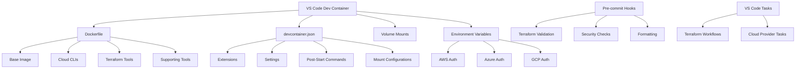
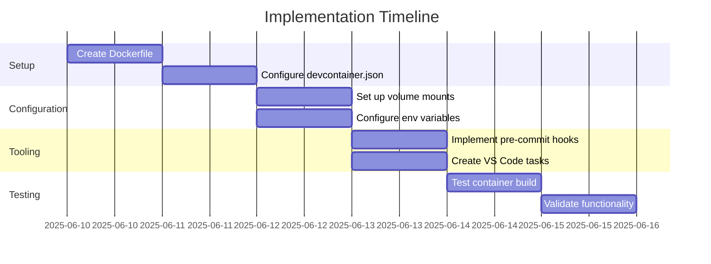

# Terraform Development Environment Plan

## Overview

This document outlines a comprehensive plan for creating a robust Terraform development environment using VS Code Dev Containers with support for AWS, Azure, and GCP.



## 1. Dockerfile Configuration

### Base Image Selection
- Use the official Microsoft VS Code Dev Container base image with Ubuntu 22.04 (jammy)
- Include essential build tools and development libraries

### Tool Installation
- **Terraform CLI**: Latest stable version with version pinning
- **Cloud Provider CLIs**:
  - AWS CLI v2
  - Azure CLI
  - Google Cloud SDK
- **Terraform Supporting Tools**:
  - tflint (with AWS, Azure, and GCP rulesets)
  - terraform-docs
  - tfsec
  - terrascan
  - terragrunt
  - infracost
  - checkov

### Version Pinning Strategy
- Pin all tool versions to specific releases for reproducibility
- Include a mechanism to easily update versions when needed

## 2. devcontainer.json Configuration

### Extensions
- HashiCorp Terraform
- Azure Terraform
- Terraform doc snippets
- YAML support
- Git Graph
- Git History
- GitLens
- Docker
- Remote Containers
- Code Spell Checker
- Markdown All in One

### Settings
- Configure Terraform formatting settings
- Set up terminal profiles for each cloud provider
- Configure editor settings for optimal Terraform development

### Features
- Enable GitHub CLI
- Configure Git with credential forwarding

### Mount Configurations
- Set up persistent volume mounts for:
  - ~/.aws
  - ~/.azure
  - ~/.config/gcloud
  - ~/.ssh
  - ~/.terraform.d/plugin-cache

## 3. Pre-commit Hooks Configuration

### Terraform-specific Hooks
- terraform fmt
- terraform validate
- terraform-docs
- tflint
- tfsec
- checkov

### General Code Quality Hooks
- Trailing whitespace removal
- End-of-file fixing
- Large file checking
- Merge conflict detection
- YAML/JSON validation

## 4. Environment Variables Configuration

### AWS Authentication
- AWS_PROFILE
- AWS_REGION
- AWS_SDK_LOAD_CONFIG

### Azure Authentication
- ARM_SUBSCRIPTION_ID
- ARM_TENANT_ID
- ARM_CLIENT_ID
- ARM_CLIENT_SECRET (with secure handling)

### GCP Authentication
- GOOGLE_APPLICATION_CREDENTIALS
- CLOUDSDK_CORE_PROJECT

### Terraform Configuration
- TF_PLUGIN_CACHE_DIR
- TF_CLI_ARGS
- TF_LOG (for debugging)

## 5. VS Code tasks.json Configuration

### Terraform Workflow Tasks
- terraform init
- terraform plan
- terraform apply
- terraform destroy
- terraform validate
- terraform fmt

### Cloud-specific Tasks
- AWS login/logout
- Azure login/logout
- GCP login/logout
- Cloud resource listing tasks

## 6. Performance Optimization

### Container Resource Allocation
- Configure appropriate memory limits
- Set CPU allocation based on host capabilities

### Caching Strategies
- Terraform plugin caching
- Provider CLI caching
- Docker layer optimization

### Volume Mount Performance
- Use delegated consistency for non-critical mounts
- Use cached consistency for read-heavy directories

## 7. Security Considerations

### Credential Management
- Use environment variables over hardcoded credentials
- Implement credential helpers for cloud providers
- Configure .gitignore for sensitive files

### Secret Scanning
- Implement pre-commit hooks for secret detection
- Configure tfsec for security scanning
- Set up checkov for compliance checking

## Implementation Approach



## File Structure

```
.devcontainer/
├── Dockerfile
├── devcontainer.json
├── post-start.sh
├── library-scripts/
│   ├── terraform-tools.sh
│   ├── cloud-cli-tools.sh
│   └── common-utils.sh
├── scripts/
│   ├── aws-auth.sh
│   ├── azure-auth.sh
│   └── gcp-auth.sh
└── config/
    └── terraform.env

.vscode/
├── tasks.json
└── settings.json

.pre-commit-config.yaml
```

## Next Steps

1. Create the Dockerfile with all required tools and proper versioning
2. Configure the devcontainer.json with extensions and settings
3. Set up the persistent volume mounts for credentials and caching
4. Implement the pre-commit hooks for Terraform validation
5. Configure the environment variables for cloud provider authentication
6. Create the VS Code tasks.json for common Terraform workflows
7. Test and optimize the container performance