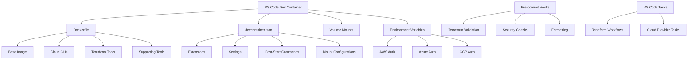
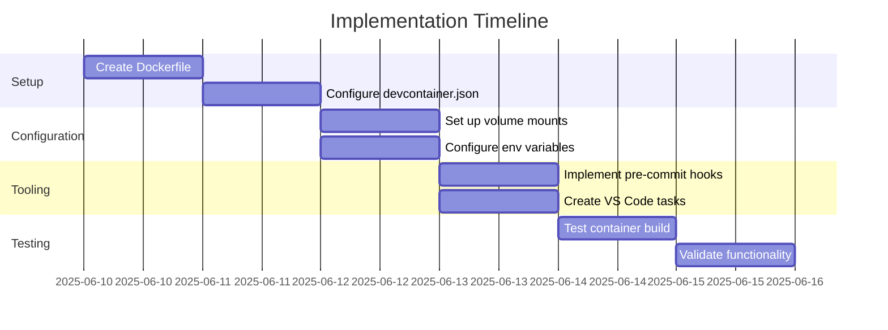

# Terraform Development Environment design plan

This document records the original design plan for the Terraform Development Environment dev container, which supports AWS, Microsoft Azure, and Google Cloud Platform (GCP). It is a historical design reference, not a description of the current state. For what the container ships today, see [README.md](README.md); for tool versions, see the configuration section of the README and `.devcontainer/devcontainer.json`.

## Overview

The plan describes a VS Code dev container for Terraform with a Dockerfile, a `devcontainer.json`, volume mounts, environment variables, pre-commit hooks, and VS Code tasks.


```mermaid
flowchart TD
    A[VS Code Dev Container] --> B[Dockerfile]
    A --> C[devcontainer.json]
    A --> D[Volume Mounts]
    A --> E[Environment Variables]

    B --> B1[Base Image]
    B --> B2[Cloud CLIs]
    B --> B3[Terraform Tools]
    B --> B4[Supporting Tools]

    C --> C1[Extensions]
    C --> C2[Settings]
    C --> C3[Post-Start Commands]
    C --> C4[Mount Configurations]

    E --> E1[AWS Auth]
    E --> E2[Azure Auth]
    E --> E3[GCP Auth]

    F[Pre-commit Hooks] --> F1[Terraform Validation]
    F --> F2[Security Checks]
    F --> F3[Formatting]

    G[VS Code Tasks] --> G1[Terraform Workflows]
    G --> G2[Cloud Provider Tasks]
```

## Dockerfile

### Base image

- Use the official Microsoft VS Code dev container base image on Ubuntu 22.04 (jammy).
- Include the build tools and development libraries the tool installers need.

### Tools

- Terraform CLI, with version pinning.
- Cloud-provider CLIs: AWS CLI v2, Azure CLI, and Google Cloud SDK.
- Terraform supporting tools: `tflint` (with the AWS, Azure, and GCP rulesets), `terraform-docs`, `tfsec`, `terrascan`, `terragrunt`, `infracost`, and `checkov`.

### Version pinning

- Pin tool versions to specific releases for reproducible builds.
- Provide a way to update versions when needed.

## devcontainer.json

### Extensions

HashiCorp Terraform, Azure Terraform, Terraform doc snippets, YAML support, Git Graph, Git History, GitLens, Docker, Remote Containers, Code Spell Checker, and Markdown All in One.

### Settings

- Configure Terraform formatting.
- Set up a terminal profile.
- Configure editor settings for Terraform development.

### Features

- Enable the GitHub CLI.
- Configure Git with credential forwarding.

### Mounts

Set up persistent mounts for `~/.aws`, `~/.azure`, `~/.config/gcloud`, `~/.ssh`, and `~/.terraform.d/plugin-cache`.

## Pre-commit hooks

### Terraform hooks

`terraform fmt`, `terraform validate`, `terraform-docs`, `tflint`, `tfsec`, and `checkov`.

### General hooks

Trailing-whitespace removal, end-of-file fixing, large-file checks, merge-conflict detection, and YAML/JSON validation.

## Environment variables

### AWS

`AWS_PROFILE`, `AWS_REGION`, `AWS_SDK_LOAD_CONFIG`.

### Azure

`ARM_SUBSCRIPTION_ID`, `ARM_TENANT_ID`, `ARM_CLIENT_ID`, `ARM_CLIENT_SECRET` (handled securely).

### GCP

`GOOGLE_APPLICATION_CREDENTIALS`, `CLOUDSDK_CORE_PROJECT`.

### Terraform

`TF_PLUGIN_CACHE_DIR`, `TF_CLI_ARGS`, `TF_LOG` (for debugging).

## VS Code tasks

### Terraform workflow tasks

`terraform init`, `terraform plan`, `terraform apply`, `terraform destroy`, `terraform validate`, and `terraform fmt`.

### Cloud-provider tasks

AWS, Azure, and GCP login, and cloud resource listing.

## Performance

### Resource allocation

Set memory limits and CPU allocation based on the host's capabilities.

### Caching

Cache Terraform plugins and provider CLIs, and optimize Docker layers.

### Volume mount performance

Use delegated consistency for non-critical mounts and cached consistency for read-heavy directories.

## Security

### Credential management

- Prefer environment variables over hardcoded credentials.
- Use credential helpers for cloud providers.
- Configure `.gitignore` for sensitive files.

### Secret scanning

- Add a pre-commit hook for secret detection.
- Configure `tfsec` for security scanning.
- Configure `checkov` for compliance checking.

## Implementation timeline

This timeline is part of the original plan and is kept for historical reference. The dates do not reflect the project's actual progress.


```mermaid
gantt
    title Implementation Timeline
    dateFormat  YYYY-MM-DD
    section Setup
    Create Dockerfile           :a1, 2025-06-10, 1d
    Configure devcontainer.json :a2, after a1, 1d
    section Configuration
    Set up volume mounts        :b1, after a2, 1d
    Configure env variables     :b2, after a2, 1d
    section Tooling
    Implement pre-commit hooks  :c1, after b1, 1d
    Create VS Code tasks        :c2, after b1, 1d
    section Testing
    Test container build        :d1, after c1, 1d
    Validate functionality      :d2, after d1, 1d
```

## File structure

```text
.devcontainer/
├── Dockerfile
├── devcontainer.json
├── post-start.sh
├── library-scripts/
│   ├── terraform-tools.sh
│   ├── cloud-cli-tools.sh
│   └── common-utils.sh
├── scripts/
│   ├── aws-auth.sh
│   ├── azure-auth.sh
│   └── gcp-auth.sh
└── config/
    └── terraform.env

.vscode/
├── tasks.json
└── settings.json

.pre-commit-config.yaml
```

## Next steps

1. Create the Dockerfile with the required tools and version pinning.
2. Configure `devcontainer.json` with extensions and settings.
3. Set up the persistent volume mounts for credentials and caching.
4. Add the pre-commit hooks for Terraform validation.
5. Configure the environment variables for cloud-provider authentication.
6. Create `tasks.json` for the common Terraform workflows.
7. Test and tune the container's performance.
